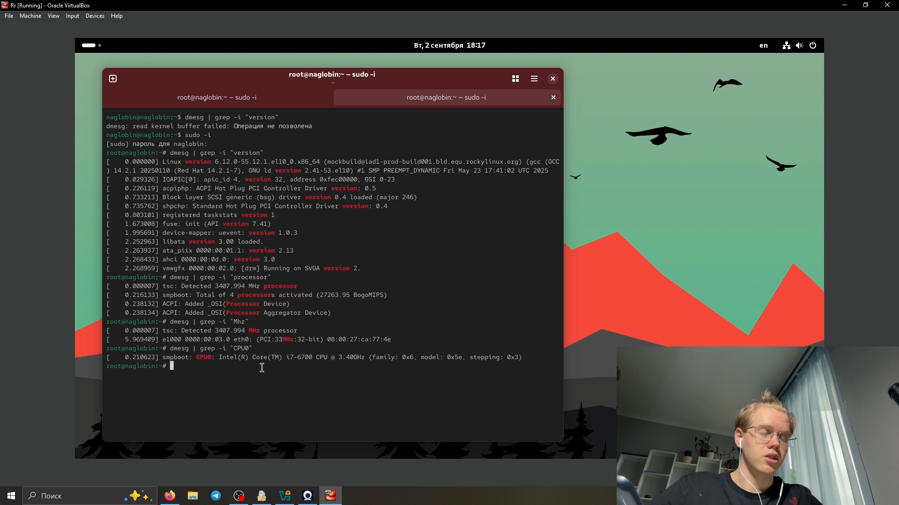

---
## Front matter
title: "Установка и конфигурация операционной системы "
subtitle: "на виртуальную машину"
author: "Глобин Никита Анатольевич"

## Generic otions
lang: ru-RU
toc-title: "Содержание"

## Bibliography
bibliography: bib/cite.bib
csl: pandoc/csl/gost-r-7-0-5-2008-numeric.csl

## Pdf output format
toc: true # Table of contents
toc-depth: 2
lof: true # List of figures
lot: true # List of tables
fontsize: 12pt
linestretch: 1.5
papersize: a4
documentclass: scrreprt
## I18n polyglossia
polyglossia-lang:
  name: russian
  options:
	- spelling=modern
	- babelshorthands=true
polyglossia-otherlangs:
  name: english
## I18n babel
babel-lang: russian
babel-otherlangs: english
## Fonts
mainfont: IBM Plex Serif
romanfont: IBM Plex Serif
sansfont: IBM Plex Sans
monofont: IBM Plex Mono
mathfont: STIX Two Math
mainfontoptions: Ligatures=Common,Ligatures=TeX,Scale=0.94
romanfontoptions: Ligatures=Common,Ligatures=TeX,Scale=0.94
sansfontoptions: Ligatures=Common,Ligatures=TeX,Scale=MatchLowercase,Scale=0.94
monofontoptions: Scale=MatchLowercase,Scale=0.94,FakeStretch=0.9
mathfontoptions:
## Biblatex
biblatex: true
biblio-style: "gost-numeric"
biblatexoptions:
  - parentracker=true
  - backend=biber
  - hyperref=auto
  - language=auto
  - autolang=other*
  - citestyle=gost-numeric
## Pandoc-crossref LaTeX customization
figureTitle: "Рис."
tableTitle: "Таблица"
listingTitle: "Листинг"
lofTitle: "Список иллюстраций"
lotTitle: "Список таблиц"
lolTitle: "Листинги"
## Misc options
indent: true
header-includes:
  - \usepackage{indentfirst}
  - \usepackage{float} # keep figures where there are in the text
  - \floatplacement{figure}{H} # keep figures where there are in the text
---

# Цель работы

Целью данной работы является приобретение практических навыков установки опера-
ционной системы на виртуальную машину, настройки минимально необходимых для
дальнейшей работы сервисов

# Задание

Целью данной работы является приобретение практических навыков установки опера-
ционной системы на виртуальную машину, настройки минимально необходимых для
дальнейшей работы сервисов

# Теоретическое введение

# Выполнение лабораторной работы

# устоновка системы

- Окно «Имя и операционная система виртуальной машины», путь к iso-образу рис. ([-@fig:001]).

{#fig:001 width=70%}

- выдиляем необходимое количество gpu Окно Оборудование рис. ([-@fig:002]).

{#fig:002 width=70%}

- выдиляем необходимое количество памяти Окно «Оборудование рис. ([-@fig:003]).

{#fig:003 width=70%}

-  Запуск установки виртуальной машины рис. ([-@fig:004]).

{#fig:004 width=70%}

# настройка устоновщика 

- Установка русского языка интерфейса ОС  рис. ([-@fig:005]).

{#fig:005 width=70%}

- настройка сети  рис. ([-@fig:006]).

{#fig:006 width=70%}

- настройка root рис. ([-@fig:007]).

{#fig:007 width=70%}

- настройка пользователя рис. ([-@fig:008]).

{#fig:008 width=70%}

#  Подключение образа диска дополнений гостевой ОС через консоль

- прописываем команду cd /run/media/имя_пользователя/VBox_GAs_версия/./VBoxLinuxAdditions.run рис. ([-@fig:010]).

{#fig:010 width=70%}

- перезагружаем систему рис. ([-@fig:011]).

{#fig:011 width=70%}

# домашнее задание

1. Версия ядра Linux (Linux version). рис. ([-@fig:013]).

{#fig:013 width=70%}

2. Частота процессора (Detected Mhz processor). рис. ([-@fig:014]).

{#fig:014 width=70%}

3. Модель процессора (CPU0). рис. ([-@fig:015]).

{#fig:015 width=70%}

4. Объем доступной оперативной памяти (Memory available). рис. ([-@fig:016]).

{#fig:016 width=70%}

5. Тип обнаруженного гипервизора (Hypervisor detected). рис. ([-@fig:017]).

{#fig:017 width=70%}

6. Тип файловой системы корневого раздела. рис. ([-@fig:018]).

{#fig:0181 width=70%}

7. Последовательность монтирования файловых систем. рис. ([-@fig:018]).

{#fig:018 width=70%}

# Контрольные вопросы

1. Укажите команды терминала и приведите примеры:

-  Для получения справки по команде: 
man <команда> 
<команда> --help 

- Для перемещения по файловой системе:
cd <путь> 
cd .. 

- Для просмотра содержимого каталога:
ls 
ls -l 

- Для определения объёма каталога:
du -sh <каталог>

- Для создания / удаления каталогов / файлов:
mkdir <каталог> 
rm -r <каталог> 
touch <имя_файла> 
rm <имя_файла> 

- Для задания определённых прав на файл / каталог:
chmod <права> <файл/каталог> 
chown <владелец>:<группа> <файл>

- Для просмотра истории команд:
history

2. Какую информацию содержит учётная запись пользователя? Какие команды позволяют посмотреть информацию о пользователе?

Учётная запись пользователя содержит:

- Имя пользователя (login)

- Уникальный идентификатор (UID)

- Группу (GID)

- Домашний каталог

- Оболочку (shell)

- Хеш пароля (в теневом файле)

Команды для просмотра:

id <имя_пользователя> 
whoami
getent passwd <имя_пользователя> 

3. Что такое файловая система? Примеры с краткой характеристикой:

Файловая система — это способ организации, хранения и управления данными на носителе информации.

Примеры:

- ext4 — распространённая в Linux, поддерживает большие объёмы, журнальная.

- xfs — высокопроизводительная, хороша для больших файлов.

- NTFS — используется в Windows, поддерживает большие файлы и права доступа.

- FAT32 — простая и кроссплатформенная, но ограничена по размеру файлов (до 4 ГБ).

4. Как посмотреть, какие файловые системы подмонтированы в ОС?

Команды:

mount 
df -h 
lsblk -f 
cat /etc/mtab 

5. Как удалить зависший процесс?

Сначала нужно узнать PID (идентификатор процесса):

kill <PID> 
kill -9 <PID>

# Выводы

В ходе лабораторной работы была установлена и настроена операционная система Rocky Linux в виртуальной машине VirtualBox. Проведена настройка параметров оборудования, установка необходимых компонентов, создание пользователя и конфигурация системы согласно требованиям. Дополнительно получена системная информация с помощью команды dmesg.

