---
## Front matter
lang: ru-RU
title: Управление пользователями и группами
subtitle: Лабораторная работа № 2
author:
  - Глобин Никита Анатольевич
institute:
  - Российский университет дружбы народов, Москва, Россия
  - Объединённый институт ядерных исследований, Дубна, Россия
date: 09 09 2025

## i18n babel
babel-lang: russian
babel-otherlangs: english

## Formatting pdf
toc: false
toc-title: Содержание
slide_level: 2
aspectratio: 169
section-titles: true
theme: metropolis
header-includes:
 - \metroset{progressbar=frametitle,sectionpage=progressbar,numbering=fraction}
---

# Информация

## Докладчик

:::::::::::::: {.columns align=center}
::: {.column width="70%"}

  * Глобин Никита Анатольевич


:::
::: {.column width="30%"}


:::
::::::::::::::

# Вводная часть


## Объект и предмет исследования

- Управление пользователями и группами

## Цели и задачи

- Управление пользователями и группами

## Материалы и методы

- Процессор `pandoc` для входного формата Markdown
- Результирующие форматы
	- `pdf`
	- `html`
- Автоматизация процесса создания: `Makefile`

# Создание презентации

## Процессор `pandoc`

- Pandoc: преобразователь текстовых файлов
- Сайт: <https://pandoc.org/>
- Репозиторий: <https://github.com/jgm/pandoc>

## Формат `pdf`

- Использование LaTeX
- Пакет для презентации: [beamer](https://ctan.org/pkg/beamer)
- Тема оформления: `metropolis`

## Код для формата `pdf`

```yaml
slide_level: 2
aspectratio: 169
section-titles: true
theme: metropolis
```

## Формат `html`

- Используется фреймворк [reveal.js](https://revealjs.com/)
- Используется [тема](https://revealjs.com/themes/) `beige`

## Код для формата `html`

- Тема задаётся в файле `Makefile`

```make
REVEALJS_THEME = beige 
```
# Результаты

## Получающиеся форматы

- Полученный `pdf`-файл можно демонстрировать в любой программе просмотра `pdf`
- Полученный `html`-файл содержит в себе все ресурсы: изображения, css, скрипты

# Элементы презентации


## Цели и задачи

1. Переключение учётных записей пользователей  
2. Создание учётных записей пользователей  
3. Работа с группами  
4. Контрольные вопросы  


## Переключение учётных записей пользователей

2. Войшли в систему как обычный пользователь и откроем терминал, узнаем какую учётную запись пользователя вы используете, введя команду whoami (рис. [-@fig:001]).

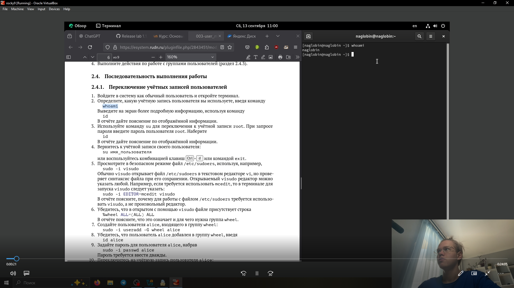{#fig:001 width=70%}

Выведем на экран более подробную информацию, используя команду id (рис. [-@fig:002])

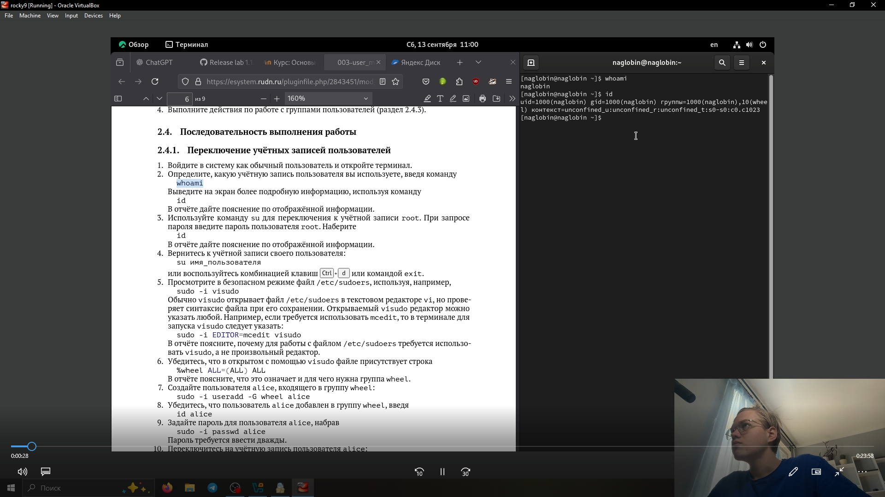{#fig:002 width=70%}


## Переключение учётных записей пользователей 2

3. Используем команду su для переключения к учётной записи root. При запросе пароля введем пароль пользователя root.(рис. [-@fig:003])

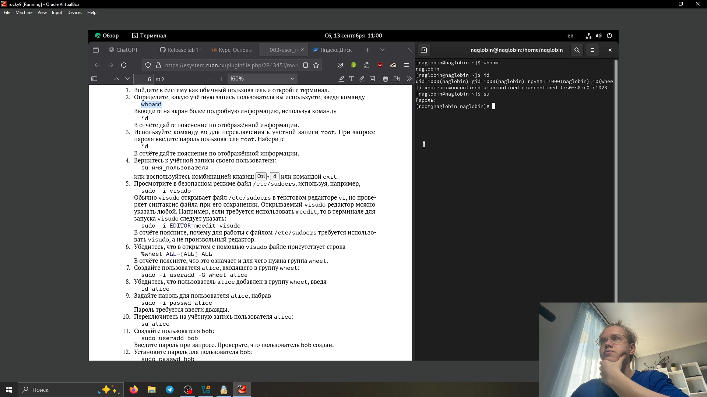{#fig:003 width=70%}

мы видем что id пользователя root 0 потому что это зарезервированый номер. то же и с группой. так же мы видем что срок для пороля безграничный (рис. [-@fig:004])

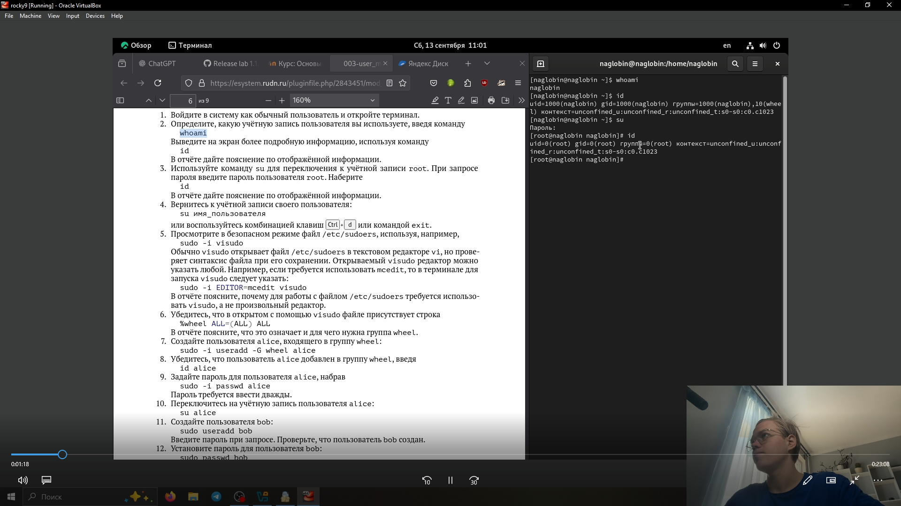{#fig:004 width=70%}

## Переключение учётных записей пользователей 3

4. вернем к учётной записи своего пользователя: su имя_пользователя (рис. [-@fig:005])

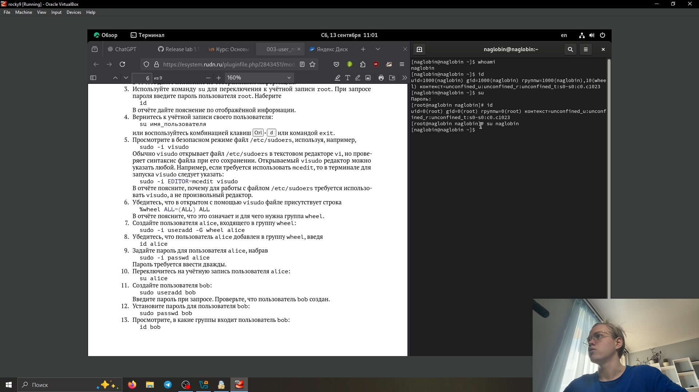{#fig:005 width=70%}


5. просмотрим в безопасном режиме файл /etc/sudoers, используя, например, sudo -i visudo (рис. [-@fig:006])

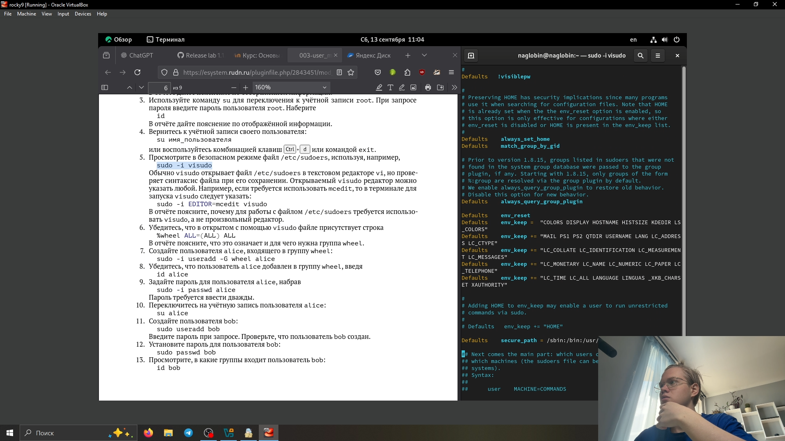{#fig:006 width=70%}


## Переключение учётных записей пользователей 4


6. Убедимся, что в открытом с помощью visudo файле присутствует строка %wheel ALL=(ALL) ALL (рис. [-@fig:007])

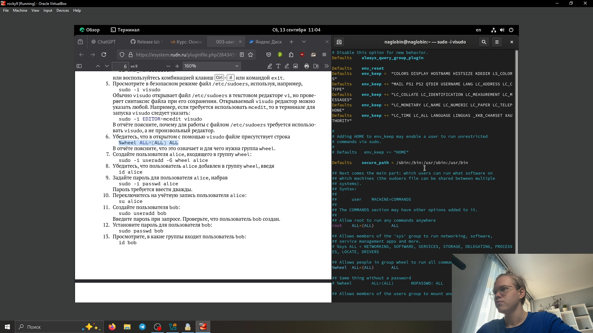{#fig:007 width=70%}

Группа wheel используется для:
* Централизованного управления доступом к sudo: только участники группы могут выполнять команды с повышенными правами.
* Повышения безопасности: можно легко ограничить или предоставить доступ к административным правам.
* Соответствия практике безопасного администрирования: root-доступ предоставляется не напрямую, а через sudo, с логированием действий.


## Переключение учётных записей пользователей 5


7. СоздаЕМ пользователя alice, входящего в группу wheel: sudo -i useradd -G wheel alice (рис. [-@fig:008])

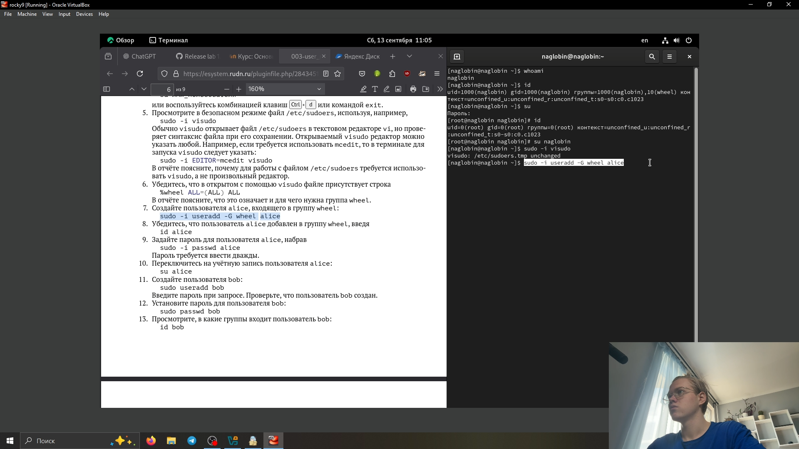{#fig:008 width=70%}


8. Проверяем, что пользователь alice добавлен в группу wheel, введя
id alice (рис. [-@fig:009])

{#fig:009 width=70%}


## Переключение учётных записей пользователей 6


9. Задаем пароль для пользователя alice, набрав sudo -i passwd alice (рис. [-@fig:010])


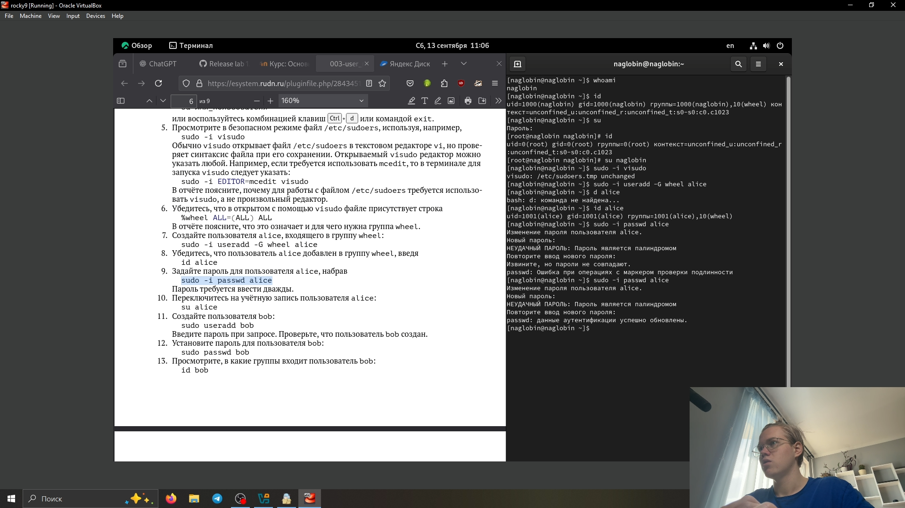{#fig:010 width=70%}

10. Переключимся на учётную запись пользователя alice: su alice (рис. [-@fig:011])

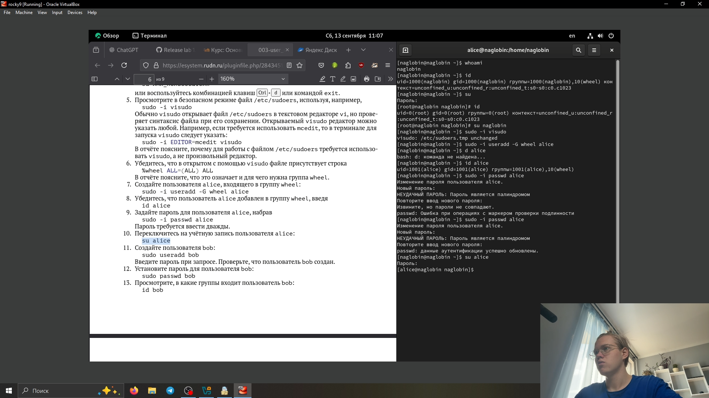{#fig:011 width=70%}


## Переключение учётных записей пользователей 7


11. Создаем пользователя bob: sudo useradd bob (рис. [-@fig:012])

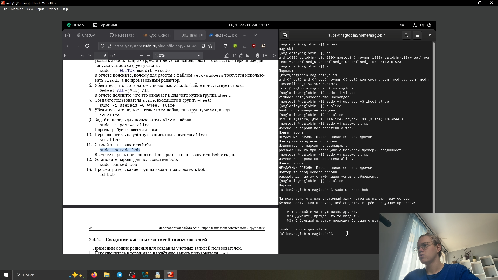{#fig:012 width=70%}


12. Установим пароль для пользователя bob: sudo passwd bob (рис. [-@fig:013])

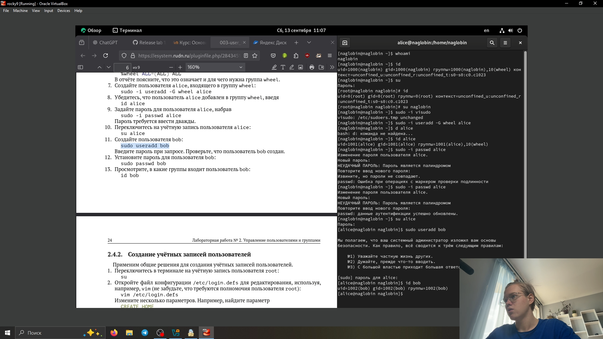{#fig:013 width=70%}


## Переключение учётных записей пользователей 8


13. Просмотрим, в какие группы входит пользователь bob: id bob (рис. [-@fig:014])

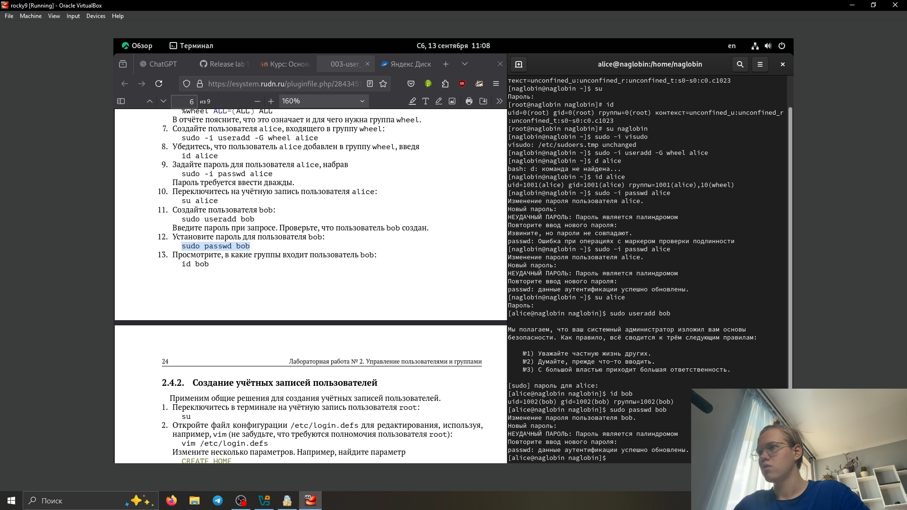{#fig:014 width=70%}

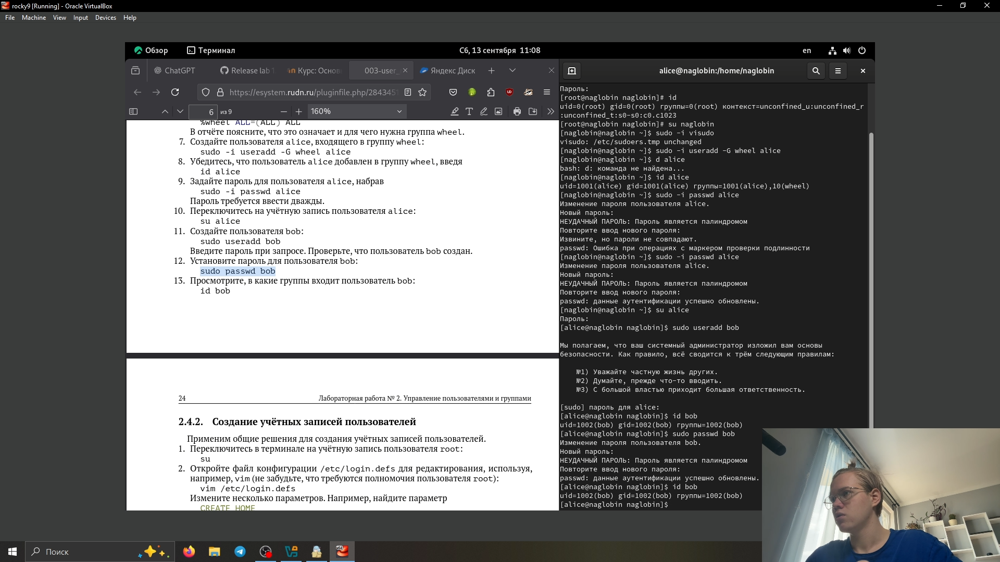{#fig:015 width=70%}


## Создание учётных записей пользователей

1. Переключимся в терминале на учётную запись пользователя root: su (рис. [-@fig:016])

{#fig:016 width=70%}

2. Откроем файл конфигурации /etc/login.defs для редактирования, используя, например, vim (не забудьте, что требуются полномочия пользователя root): sudo vim /etc/login.defs
Измените несколько параметров. Например, найдите параметр
CREATE_HOME
и убедитесь, что он установлен в значение yes. Также установите параметр
USERGROUPS_ENAB no
Это позволит не добавлять нового пользователя в группу с тем же именем, что и поль-
зователь, а использовать группу users.(рис. [-@fig:017]) (рис. [-@fig:018]) (рис. [-@fig:019])

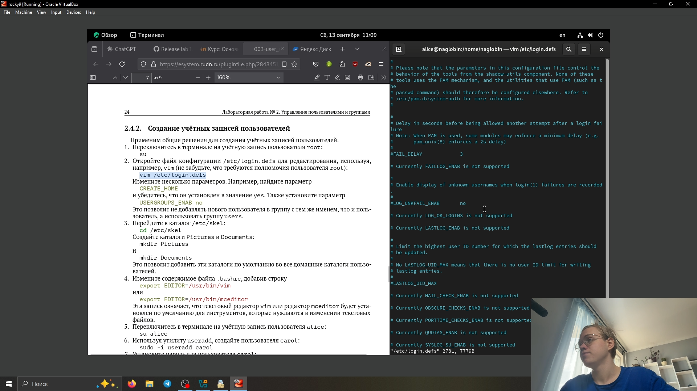{#fig:017 width=70%}


## Создание учётных записей пользователей 2

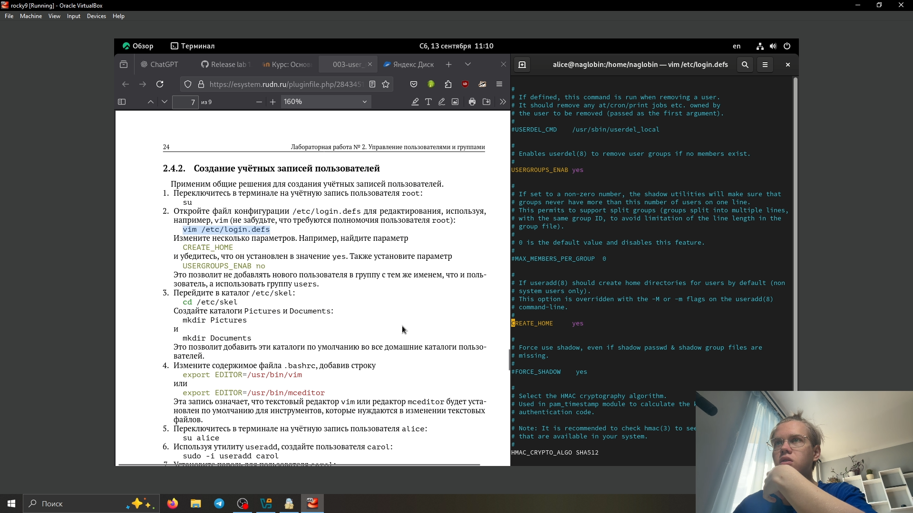{#fig:18 width=70%}

## Создание учётных записей пользователей 3


{#fig:019 width=70%}


## Создание учётных записей пользователей 4


3. Перейдем в каталог /etc/skel:
cd /etc/skel
Создайте каталоги Pictures и Documents:
mkdir Pictures
и
mkdir Documents
Это позволит добавить эти каталоги по умолчанию во все домашние каталоги пользо-
вателей.(рис. [-@fig:022])

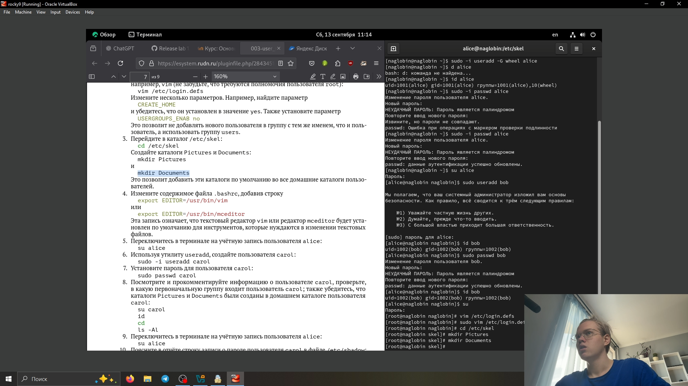{#fig:022 width=70%}


## Создание учётных записей пользователей 5


4. Изменим содержимое файла .bashrc, добавив строку export EDITOR=/usr/bin/mceditor (рис. [-@fig:023]) и (рис. [-@fig:024])

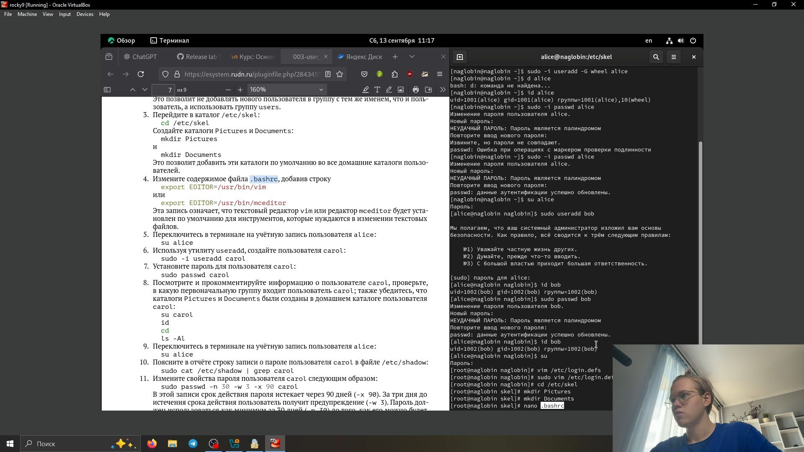{#fig:023 width=70%}

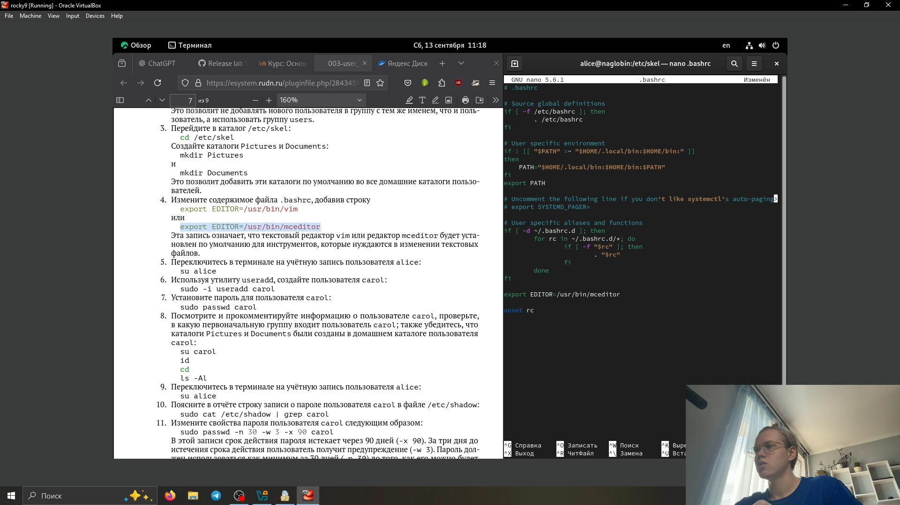{#fig:024 width=70%}

5. Переключем в терминале на учётную запись пользователя alice: su alice (рис. [-@fig:025])

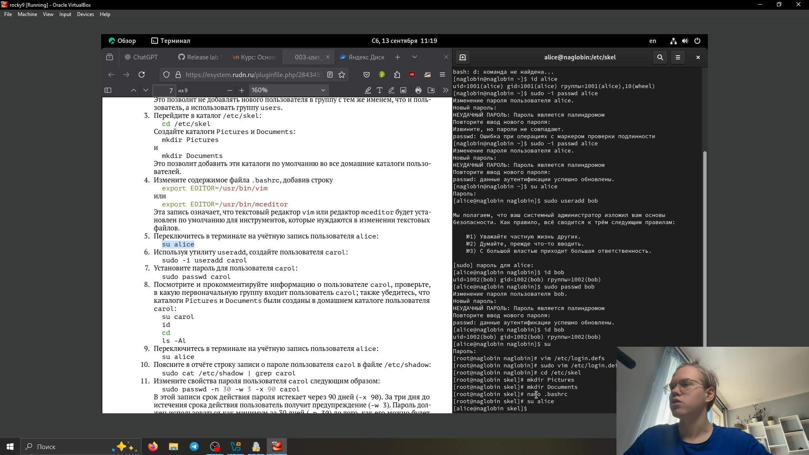{#fig:025 width=70%}

## Создание учётных записей пользователей 6


6. Используя утилиту useradd, создадим пользователя carol:
sudo -i useradd carol (рис. [-@fig:026])

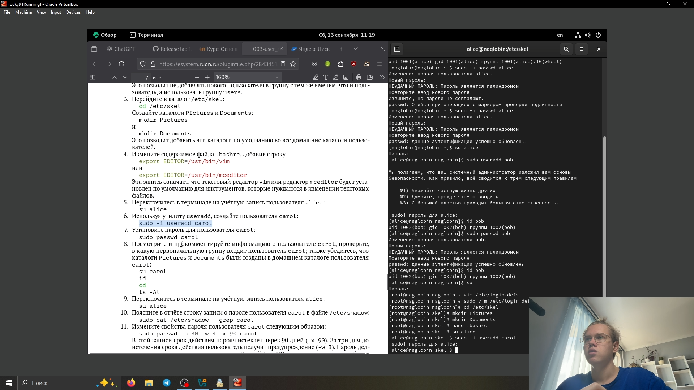{#fig:026 width=70%}


7. Установим пароль для пользователя carol:
sudo passwd carol (рис. [-@fig:027])

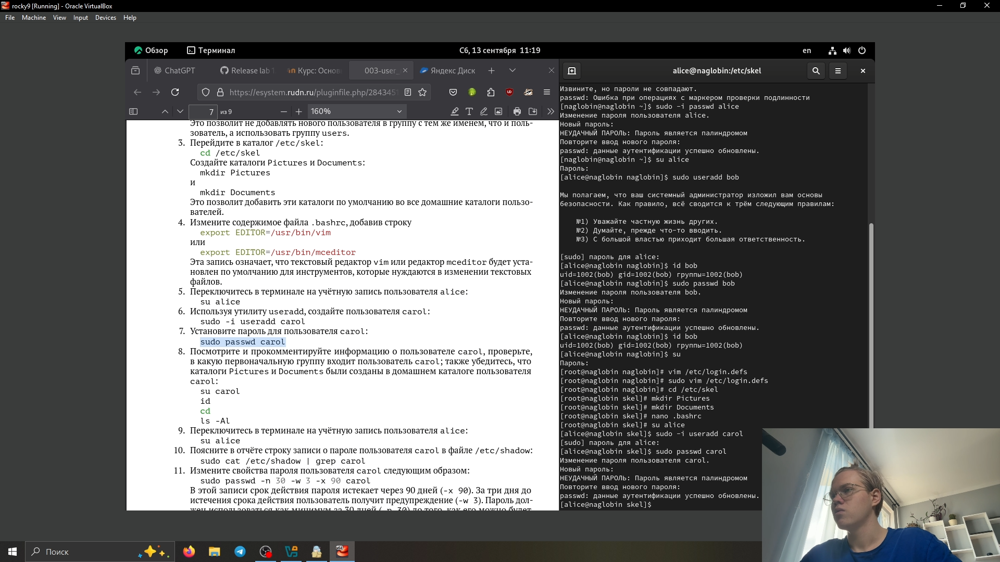{#fig:027 width=70%}

## Создание учётных записей пользователей 7


8. совершим ряд действий (рис. [-@fig:028]) 

* Пользователь carol имеет UID 1002 и входит в группу с GID 100 под именем users. Это соответствует тому, что параметр USERGROUPS_ENAB был установлен в no — в этом случае не создаётся отдельная группа carol, а пользователь добавляется в общую группу users.

* Каталоги Documents и Pictures присутствуют в домашнем каталоге пользователя carol. Это подтверждает, что шаблонные директории, созданные в /etc/skel, автоматически копируются при создании новой учётной записи. Это удобно для стандартизации структуры домашнего каталога пользователей.

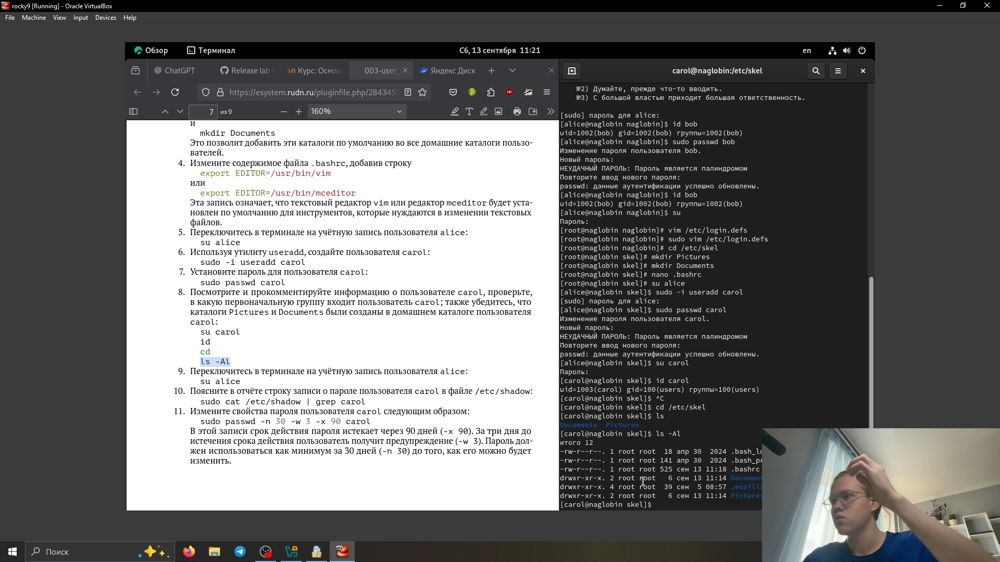{#fig:028 width=70%}


## Создание учётных записей пользователей 8


9. Переключимся в терминале на учётную запись пользователя alice:
su alice (рис. [-@fig:029])

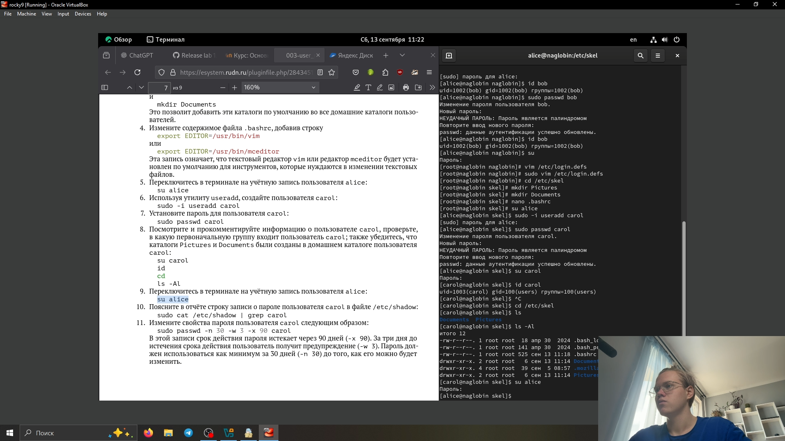{#fig:029 width=70%}


## Создание учётных записей пользователей 9


10. Файл /etc/shadow содержит зашифрованные пароли и параметры политики паролей для пользователей системы. Каждая строка содержит 9 полей, разделённых двоеточиями (рис. [-@fig:030])

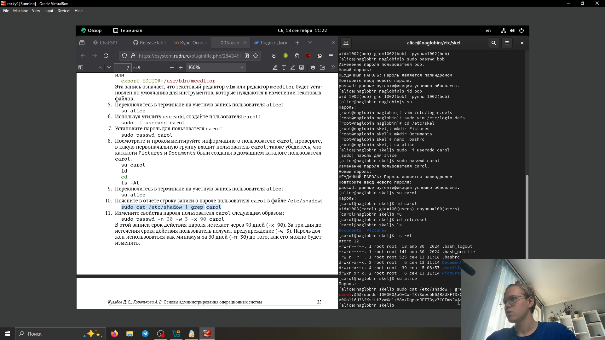{#fig:030 width=70%}

Мы видем зашефрованый пароль, полшьзователя, время которое ещё будет действоват пароль, время с момента создания пароля и время за сколько всплывет напоминани о смене пророля.

## Создание учётных записей пользователей 10


11. Изменим свойства пароля пользователя carol следующим образом:
sudo passwd -n 30 -w 3 -x 90 carol (рис. [-@fig:031])

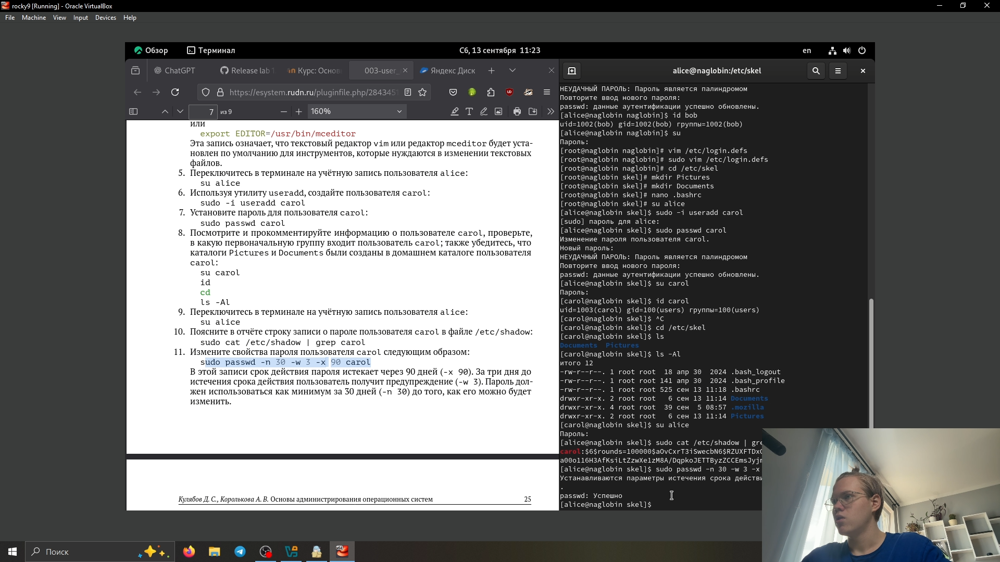{#fig:031 width=70%}


## Создание учётных записей пользователей 11


12. Убедимся в изменении в строке с данными о пароле пользователя carol в файле
/etc/shadow:
sudo cat /etc/shadow | grep carol (рис. [-@fig:032]) (рис. [-@fig:033]) (рис. [-@fig:034])

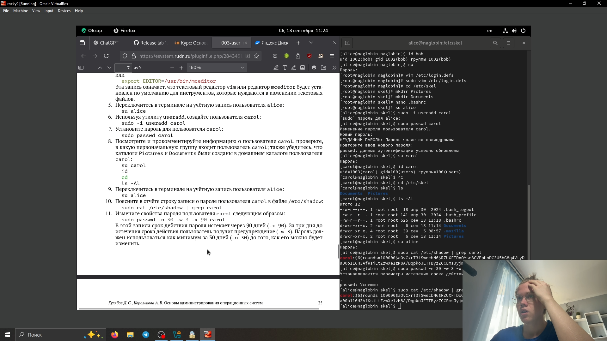{#fig:032 width=70%}

## Создание учётных записей пользователей 12


проверяем, что идентификатор alice существует во всех трёх файлах

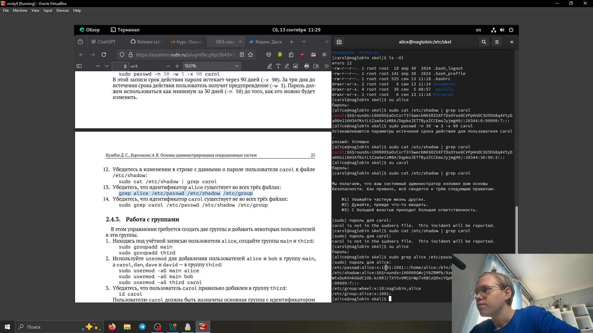{#fig:033 width=70%}

## Создание учётных записей пользователей 13


Убедимся, что идентификатор carol существует не во всех трёх файлах

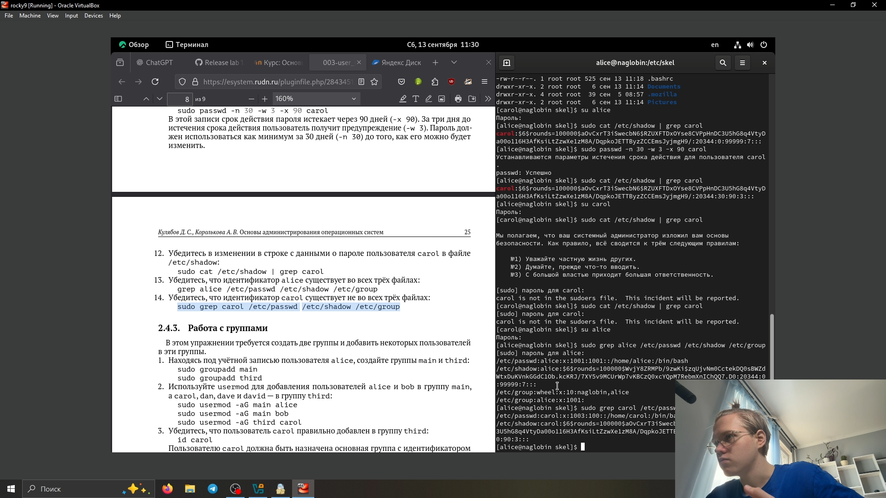{#fig:034 width=70%}

## Работа с группами 

1. Находясь под учётной записью пользователя alice, создаем группы main и third:
sudo groupadd main
sudo groupadd third (рис. [-@fig:035])

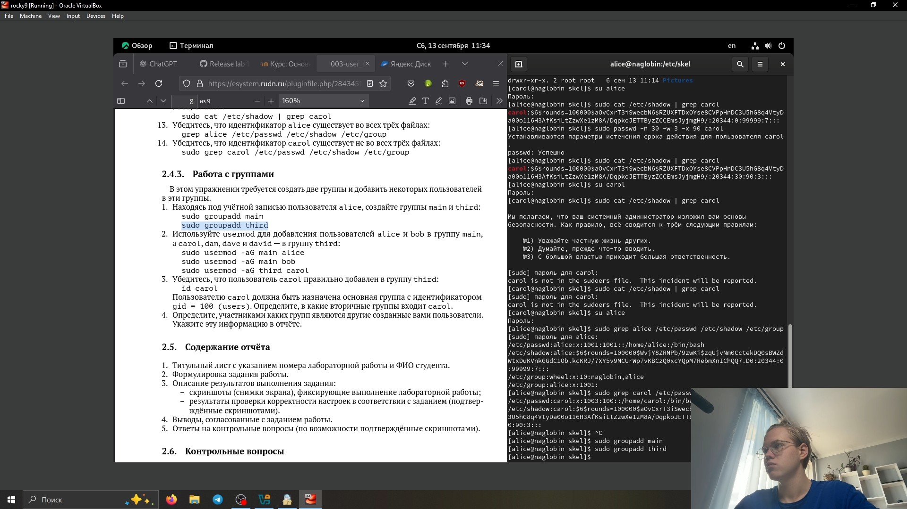{#fig:035 width=70%}


## Работа с группами 2


2. Используем usermod для добавления пользователей alice и bob в группу main,
а carol, dan, dave и david — в группу third:
sudo usermod -aG main alice
sudo usermod -aG main bob
sudo usermod -aG third caro (рис. [-@fig:036])

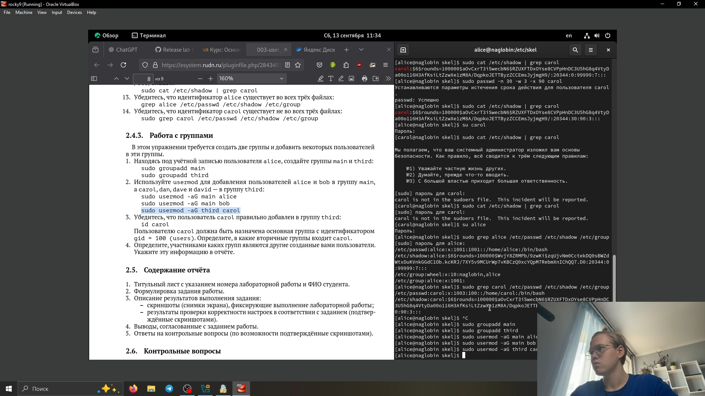{#fig:036 width=70%}

## Работа с группами 3


3. Убедимся, что пользователь carol правильно добавлен в группу third:
id carol
Пользователю carol должна быть назначена основная группа с идентификатором
gid = 100 (users). Определите, в какие вторичные группы входит carol
(рис. [-@fig:037])

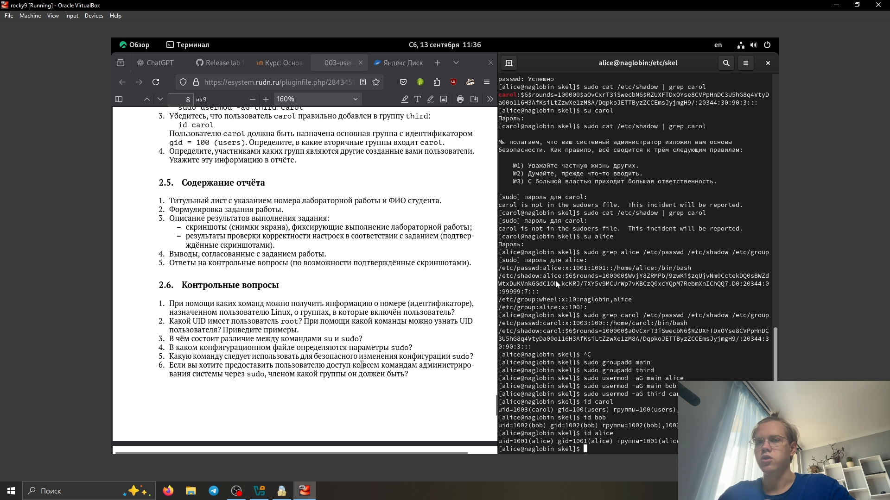{#fig:037 width=70%}

## Работа с группами 4


4. Определимм, участниками каких групп являются другие созданные вами пользователи. (рис. [-@fig:037])

* bob в bob, third, main
* alice в alice, main, wheel
* carol в users, third


## Контрольные вопросы 

1. При помощи каких команд можно получить информацию о номере (идентификаторе), назначенном пользователю Linux, и о группах, в которые он включён?

* Команда id — показывает UID, GID и список групп пользователя
* Команда groups — показывает, в какие группы входит пользователь


## Контрольные вопросы 2


2. Какой UID имеет пользователь root? Как узнать UID пользователя?

Пользователь root всегда имеет UID 0.

Чтобы узнать UID текущего пользователя: whoami


## Контрольные вопросы 3


3. В чём состоит различие между командами su и sudo?

* su Переключает на другого пользователя, запрашивая его пароль Полностью меняет окружение на другого пользователя

* sudo Выполняет одну команду от имени другого пользователя, но запрашивает ваш собственный пароль


## Контрольные вопросы 4


4. В каком конфигурационном файле определяются параметры sudo?

Основной конфигурационный файл sudo — это:/etc/sudoers


## Контрольные вопросы 5


5. Какую команду следует использовать для безопасного изменения конфигурации sudo?

Для безопасного редактирования файла /etc/sudoers следует использовать команду: visudo


## Контрольные вопросы 6


6. Если вы хотите предоставить пользователю доступ ко всем командам администрирования системы через sudo, членом какой группы он должен быть?

Пользователь должен быть добавлен в группу wheel 


## Результаты

мы научились создовать и упровлять пользователями. так же научились создовать группы и добовлять в них пользователей.


# Рекомендации

## Принцип 10/20/30

  - 10 слайдов
  - 20 минут на доклад
  - 30 кегль шрифта

## Связь слайдов

::: incremental

- Один слайд --- одна мысль
- Нельзя ссылаться на объекты, находящиеся на предыдущих слайдах (например, на формулы)
- Каждый слайд должен иметь заголовок

:::

## Количество сущностей

::: incremental

- Человек может одновременно помнить $7 \pm 2$ элемента
- При размещении информации на слайде старайтесь чтобы в сумме слайд содержал не более 5 элементов
- Можно группировать элементы так, чтобы визуально было не более 5 групп

:::

## Общие рекомендации

::: incremental

- На слайд выносится та информация, которая без зрительной опоры воспринимается хуже
- Слайды должны дополнять или обобщать содержание выступления или его частей, а не дублировать его
- Информация на слайдах должна быть изложена кратко, чётко и хорошо структурирована
- Слайд не должен быть перегружен графическими изображениями и текстом
- Не злоупотребляйте анимацией и переходами

:::

## Представление данных

::: incremental

- Лучше представить в виде схемы
- Менее оптимально представить в виде рисунка, графика, таблицы
- Текст используется, если все предыдущие способы отображения информации не подошли

:::

